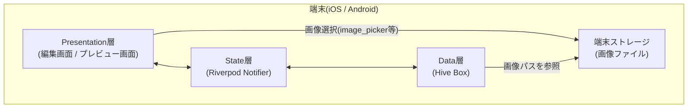
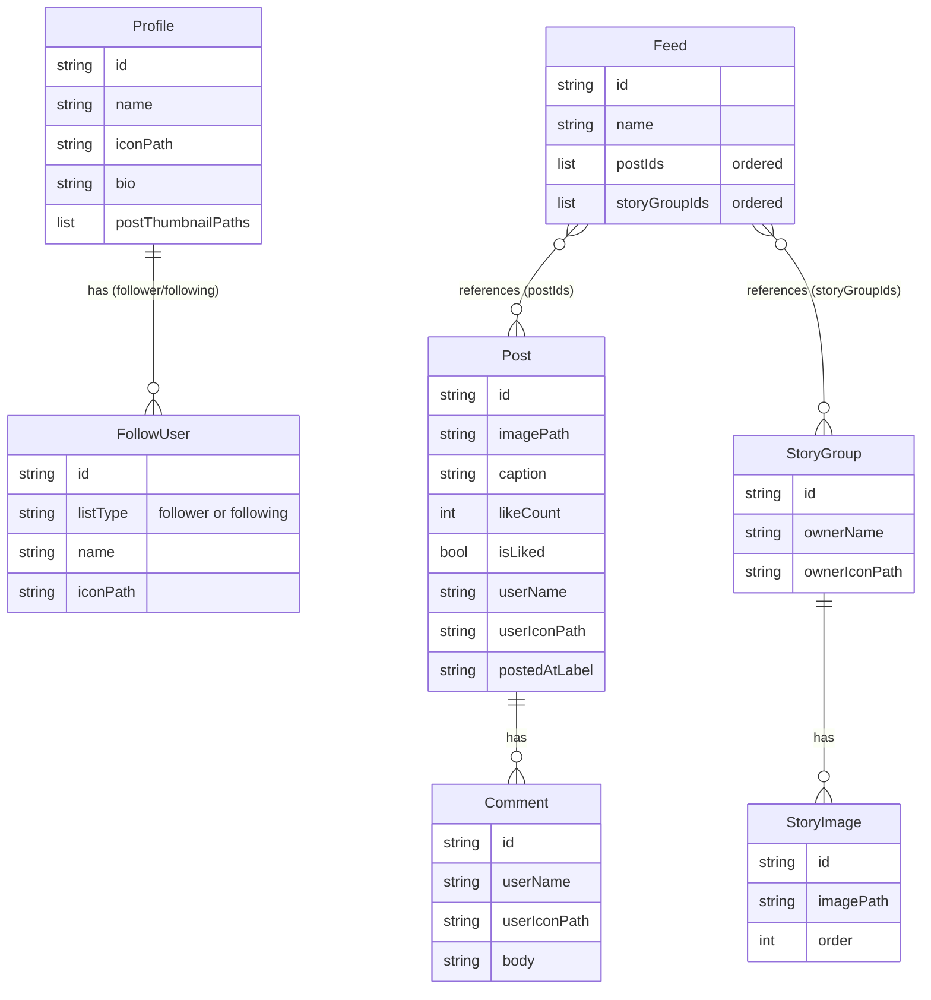
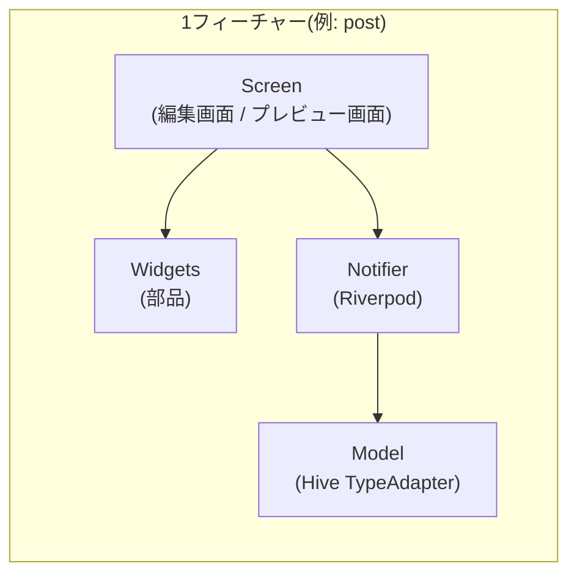
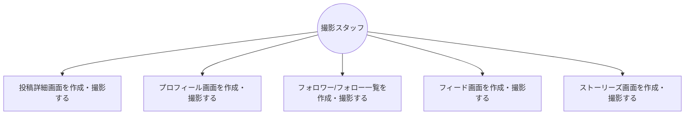
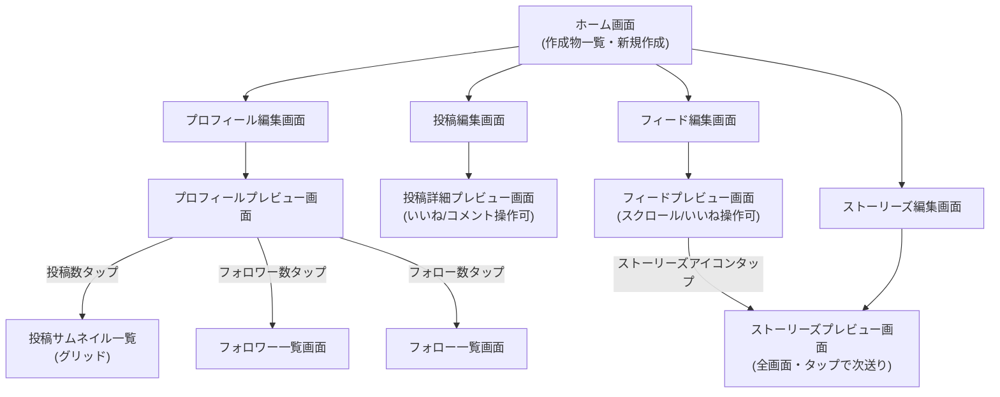

# 機能設計書: 撮影用インスタ画面メーカー

## 1. 設計方針

- 本アプリは実SNSとの通信を持たないため、サーバーサイド設計・API設計は行わない(詳細は本書末尾「7. API設計」を参照)
- 撮影現場では「同じ演者・同じ設定で複数シーンを撮る」「別シーンでは別の投稿内容にしたい」というニーズがあるため、投稿・プロフィール・ストーリーズ・フィードは、それぞれ**複数件を作成して保存し、必要な時に呼び出して使い回せる**構造とする
- 各データはユーザーが自由入力する「小道具用のダミーデータ」であり、実アカウントのような認証・相互参照(フォロー関係の整合性など)は持たせない。投稿時間も実時刻ではなく "3時間前" のような自由入力の文字列として扱う(実機の表示に似せつつ、任意の値を撮影用に設定できるようにするため)

## 2. 機能ごとのアーキテクチャ

Flutter単体で完結するローカルアプリとして、以下の3層構造を採る。

| 層 | 役割 | 技術 |
|---|---|---|
| Presentation層 | 画面(編集画面/プレビュー画面)とWidget | Flutter Widget |
| State層 | 画面状態・入力内容の保持、CRUD操作の仲介 | Riverpod (Notifier / AsyncNotifier) |
| Data層 | ローカル永続化 | Hive (TypeAdapter経由でオブジェクトを保存) |

機能(投稿/プロフィール/フォロー一覧/フィード/ストーリーズ)ごとに、上記3層をひとまとまりの「フィーチャーモジュール」として実装する(詳細は「4. コンポーネント設計」)。

## 3. システム構成図



- 外部サーバー・API通信は存在しない(完全オフライン)
- 画像は端末のギャラリー等から選択し、パス(または端末内コピー)をHiveに保存する

## 4. データモデル定義(ER図)

### 4.1 エンティティ概要

| エンティティ | 説明 | 利用画面 |
|---|---|---|
| `Post` | 1件の投稿(画像・本文・いいね・コメント・投稿者情報) | 投稿詳細画面、フィード画面 |
| `Comment` | 投稿に紐づくコメント(Post内に埋め込み) | 投稿詳細画面 |
| `Profile` | 1件のプロフィール(名前・アイコン・自己紹介・投稿サムネイル・フォロワー/フォロー一覧) | プロフィール画面、フォロワー/フォロー一覧画面 |
| `FollowUser` | フォロワー/フォロー一覧の1件(Profile内に埋め込み) | フォロワー/フォロー一覧画面 |
| `StoryGroup` | 1ユーザー分のストーリーズ(複数枚の画像を順序付きで保持) | ストーリーズ画面、フィード画面(アイコン列) |
| `StoryImage` | ストーリーズの1枚(StoryGroup内に埋め込み) | ストーリーズ画面 |
| `Feed` | フィード画面の構成(表示する投稿とストーリーズアイコンの並び順) | フィード画面 |

### 4.2 ER図



### 4.3 補足

- `Post`・`Profile`・`StoryGroup`・`Feed` はそれぞれ独立したHive Boxで複数件保存し、一覧から選択して編集・プレビューできるようにする(ホーム画面で管理)
- `Feed.postIds` / `Feed.storyGroupIds` は、既存の `Post` / `StoryGroup` のIDを並び順付きで参照する。実体は複製せず、参照先が更新されればフィード側の表示にも反映される
- プロフィール画面の「投稿数」は `postThumbnailPaths` の件数、「フォロワー数」「フォロー数」は `FollowUser`(該当`listType`)の件数から算出する(冗長な保存はしない)
- `Comment` / `FollowUser` / `StoryImage` は親エンティティに埋め込む値オブジェクトとし、独立したBoxは持たない

## 5. コンポーネント設計

Flutterのフィーチャー単位でディレクトリを分割する(詳細なフォルダ構成は `repository-structure.md` で定義)。各フィーチャーは概ね以下の構成を持つ。



### フィーチャー一覧

| フィーチャー | 主な画面 | 主なNotifier/State |
|---|---|---|
| `home` | ホーム(作成物一覧・新規作成メニュー) | 各Boxの一覧取得 |
| `post` | 投稿編集画面、投稿詳細プレビュー画面 | `PostNotifier`(単一Post編集、いいねトグル、コメント追加) |
| `profile` | プロフィール編集画面、プロフィールプレビュー画面 | `ProfileNotifier`(プロフィール編集、投稿サムネイル/フォロー一覧の追加編集) |
| `follow_list` | フォロワー一覧、フォロー一覧プレビュー画面 | `ProfileNotifier`から`FollowUser`一覧を参照(専用Notifierは持たない) |
| `feed` | フィード編集画面、フィードプレビュー画面 | `FeedNotifier`(投稿/ストーリーズの選択・並び替え) |
| `story` | ストーリーズ編集画面、ストーリーズプレビュー画面(全画面) | `StoryNotifier`(画像の追加・順序編集、再生位置の管理) |

- 共通処理(画像選択、テーマ、共通Widgetなど)は `core` (または `common`) 配下に置く
- 各フィーチャーは「編集画面(データ入力用UI)」と「プレビュー画面(実機のSNS画面に似せた、撮影用の表示画面)」を分離する。プレビュー画面はいいねトグル・コメント追加・スクロール・ストーリーズ送りなど、撮影中にその場で操作できる最低限のインタラクションのみを持つ

## 6. ユースケース図・画面遷移図

### 6.1 ユースケース図



### 6.2 画面遷移図



- 「編集画面」でダミーデータを入力・保存し、「プレビュー画面」で実機画面に近い見た目を全画面表示して撮影に使う、という2段階の流れを全フィーチャーで統一する

### 6.3 ワイヤフレーム(例: 投稿詳細プレビュー画面)

```
┌─────────────────────────┐
│ ← [アイコン] user_name  ・・・│
├─────────────────────────┤
│                         │
│       投稿画像            │
│                         │
├─────────────────────────┤
│ ♡  ○  ➤            🔖  │
│ 123 件のいいね             │
│ user_name  投稿キャプション    │
│ すべてのコメントを見る (n件)   │
│ 3時間前                  │
├─────────────────────────┤
│ [アイコン] コメントを追加...  投稿│
└─────────────────────────┘
```

## 7. API設計

本アプリは実SNSサーバー・自社バックエンドとの通信を一切行わないローカル完結型アプリのため、API設計は対象外とする。将来的にバックエンド連携(例: テンプレート共有機能など)を検討する場合は、その時点で本書に追記する。
